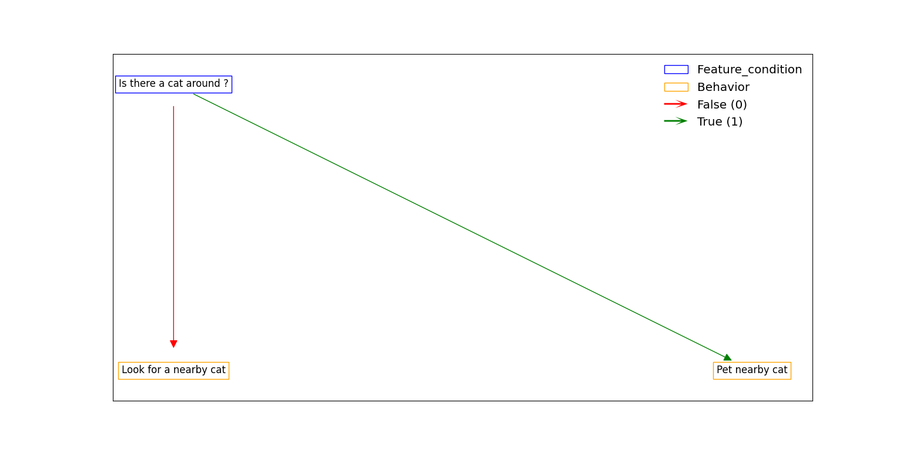

HEBG - Hierachical Explainable Behaviors using Graphs
=====================================================

.. image:: https://app.codacy.com/project/badge/Grade/ec4b296d18f4412398d64a66224c66dd
   :alt: [Codacy - Grade]
   :target: https://www.codacy.com/gh/IRLL/HEB_graphs/dashboard?utm_source=github.com&amp;utm_medium=referral&amp;utm_content=IRLL/HEB_graphs&amp;utm_campaign=Badge_Grade

.. image:: https://app.codacy.com/project/badge/Coverage/ec4b296d18f4412398d64a66224c66dd
   :alt: [Codacy - Coverage]
   :target: https://www.codacy.com/gh/IRLL/HEB_graphs/dashboard?utm_source=github.com&amp;utm_medium=referral&amp;utm_content=IRLL/HEB_graphs&amp;utm_campaign=Badge_Coverage

.. image:: https://img.shields.io/badge/code%20style-black-000000.svg
   :alt: [CodeStyle - Black]
   :target: https://github.com/psf/black

.. image:: https://img.shields.io/github/license/MathisFederico/Crafting?style=plastic
   :alt: [Licence - GPLv3]
   :target: https://www.gnu.org/licenses/


This package is meant to build programatic hierarchical behaviors as graphs
to compare them to human explanations of behavior.

We take the definition of "behavior" as a function from observation to action.


Installation
------------


.. code-block:: sh

   pip install hebg


Usage
-----

Build a HEBGraph
~~~~~~~~~~~~~~~~

Here is an example to show how could we hierarchicaly build an explanable behavior to pet a cat.

.. code-block:: py3

   """
   
   Here is the hierarchical structure that we would want:

   ```
   IsThereACatAround ?
   Yes:
      IsYourHandNearTheCat ?
      Yes:
         PetTheCat
      No:
         MoveSlowlyYourHandNearTheCat
   No:
      LookForACat
   ```

   """

   from hebg import HEBGraph, Action, FeatureCondition, Behavior

   class Pet(Action):
      def __init__(self) -> None:
         super().__init__(action="Pet")

   class IsThereACatAround(FeatureCondition):
      def __init__(self) -> None:
         super().__init__(name="Is there a cat around ?")
      def __call__(self, observation):
         # Could be a very complex function that returns 1 is there is a cat around else 0.
         if "cat" in observation:
            return int(True) # 1
         return int(False) # 0

   class IsYourHandNearTheCat(FeatureCondition):
      def __init__(self, hand) -> None:
         super().__init__(name="Is hand near the cat ?")
         self.hand = hand
      def __call__(self, observation):
         # Could be a very complex function that returns 1 is the hand is near the cat else 0.
         if observation["cat"] == observation[self.hand]:
            return int(True) # 1
         return int(False) # 0

   class MoveSlowlyYourHandNearTheCat(Behavior):
      def __init__(self) -> None:
         super().__init__(name="Move slowly your hand near the cat")
      def __call__(self, observation, *args, **kwargs) -> Action:
         # Could be a very complex function that returns actions from any given observation
         return Action("Move hand to cat")

   class LookForACat(Behavior):
      def __init__(self) -> None:
         super().__init__(name="Look for a nearby cat")
      def __call__(self, observation, *args, **kwargs) -> Action:
         # Could be a very complex function that returns actions from any given observation
         return Action("Move to a cat")

   class PetACat(Behavior):
      def __init__(self) -> None:
         super().__init__(name="pet the cat")
      def build_graph(self) -> HEBGraph:
         graph = HEBGraph(self)
         is_a_cat_around = IsThereACatAround()
         is_hand_near_cat = IsYourHandNearTheCat(hand="hand")

         graph.add_edge(is_a_cat_around, LookForACat(), index=int(False))
         graph.add_edge(is_a_cat_around, is_hand_near_cat, index=int(True))

         graph.add_edge(is_hand_near_cat, MoveSlowlyYourHandNearTheCat(), index=int(False))
         graph.add_edge(is_hand_near_cat, Pet(), index=int(True))

         return graph

   if __name__ == "__main__":
      pet_a_cat_behavior = PetACat()
      observation = {
         "cat": "sofa",
         "hand": "computer",
      }

      # Call on observation
      action = pet_a_cat_behavior(observation)
      print(action)  # Action("Move hand to cat")

      # Obtain networkx graph
      graph = pet_a_cat_behavior.graph
      print(list(graph.edges(data="index")))

      # Draw graph using matplotlib
      import matplotlib.pyplot as plt
      fig, ax = plt.subplots()
      graph.draw(ax)
      plt.show()




Python code generation from graph
~~~~~~~~~~~~~~~~~~~~~~~~~~~~~~~~~

Once you have a HEBGraph, you can use it to generate a working python code that
replicates the HEBGraph's behavior:

.. code-block:: py3

   code = pet_a_cat_behavior.graph.generate_source_code()
   with open("pet_a_cat.py", "w") as pyfile:
      pyfile.write(code)

Will generate the code bellow:

.. code-block:: py3

   from hebg.codegen import GeneratedBehavior

   # Require 'Look for a nearby cat' behavior to be given.
   # Require 'Move slowly your hand near the cat' behavior to be given.
   class PetTheCat(GeneratedBehavior):
      def __call__(self, observation):
         edge_index = self.feature_conditions['Is there a cat around ?'](observation)
         if edge_index == 0:
               return self.known_behaviors['Look for a nearby cat'](observation)
         if edge_index == 1:
               edge_index_1 = self.feature_conditions['Is hand near the cat ?'](observation)
               if edge_index_1 == 0:
                  return self.known_behaviors['Move slowly your hand near the cat'](observation)
               if edge_index_1 == 1:
                  return self.actions['Action(Pet)'](observation)


Contributing to HEBG
--------------------

Whenever you encounter a :bug: **bug** or have :tada: **feature request**, 
report this via `Github issues <https://github.com/IRLL/HEB_graphs/issues>`_.

If you wish to contribute directly, see `CONTRIBUTING <https://github.com/IRLL/HEB_graphs/blob/main/CONTRIBUTING.rst>`_
